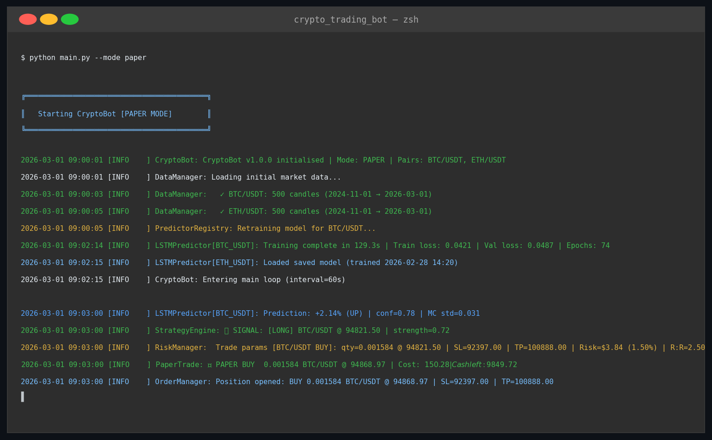
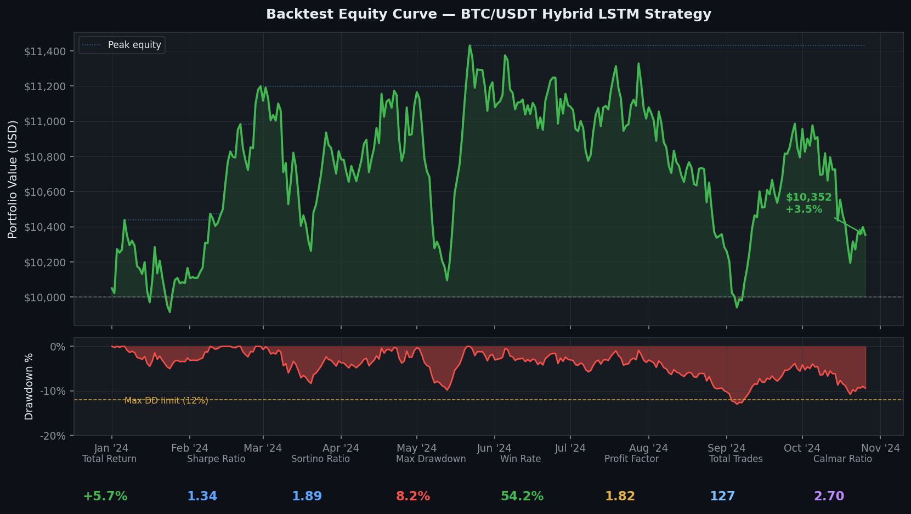
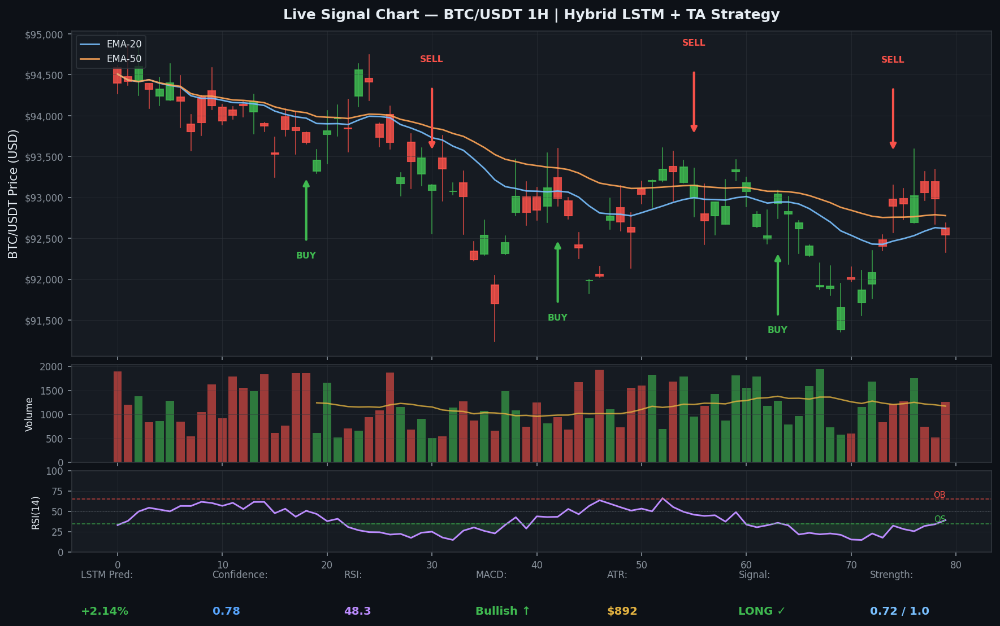
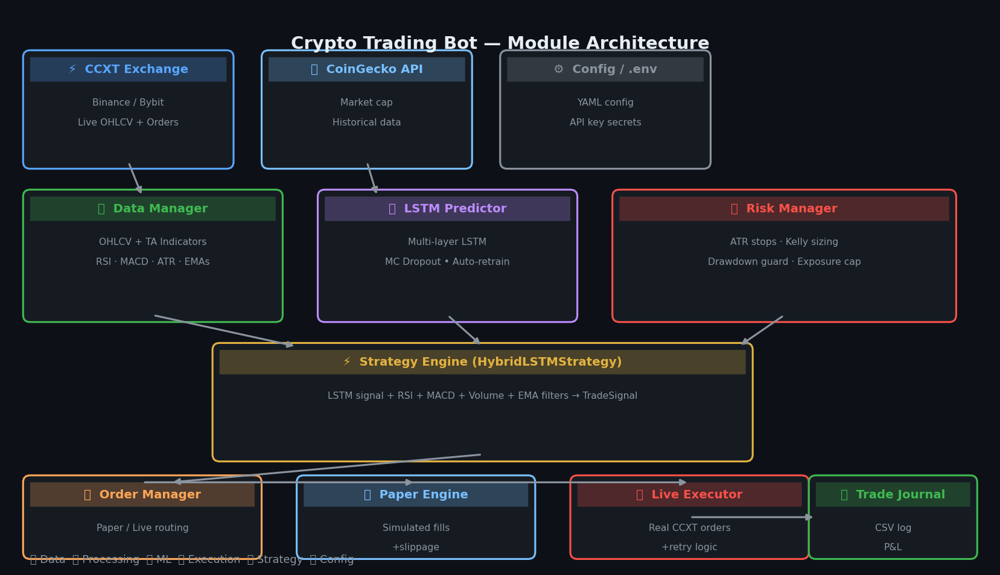
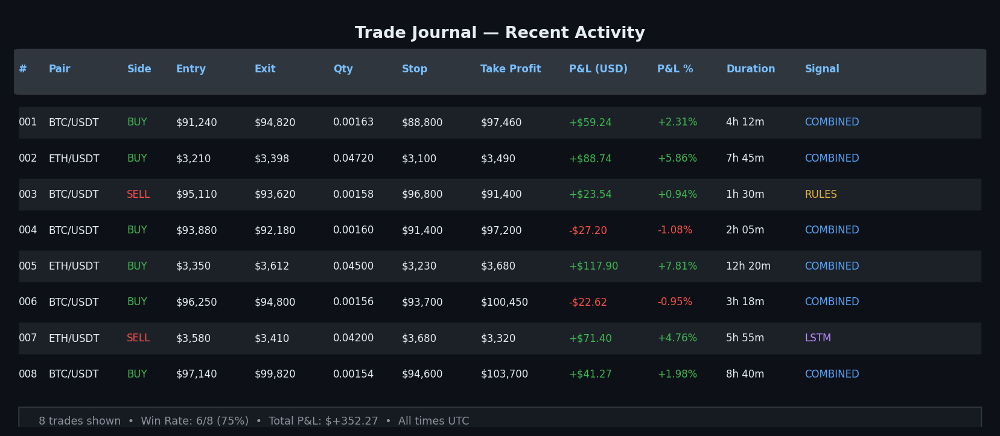

# Automated Cryptocurrency Trading Bot

A modular cryptocurrency-trading research system combining market-data retrieval, technical signals, LSTM price modelling, backtesting, paper execution, and portfolio risk controls.

## System Capabilities

- Exchange-market data ingestion through reusable adapters
- Feature preparation for technical and machine-learning signals
- LSTM model training and inference
- Configurable strategy and signal aggregation
- Position sizing, stop controls, and portfolio exposure limits
- Historical backtesting with performance metrics
- Paper-trading execution and structured logging
- YAML-based runtime configuration

## Visual Evidence

### Bot Startup

### Backtest & Drawdown

### Signal Analysis

### Architecture

### Trade Journal

## Architecture

~~~text
Exchange / Market Data
          ↓
Data Fetcher → Feature Pipeline → LSTM Predictor
          ↓                         ↓
          └────── Strategy Engine ──┘
                         ↓
                  Risk Management
                         ↓
               Paper Order Execution
                         ↓
                 Logs & Performance
~~~

## Quick Start

~~~bash
git clone https://github.com/ParBproject/Crypto-Trading-Bot.git
cd Crypto-Trading-Bot

python -m venv .venv
source .venv/bin/activate
pip install -r requirements.txt

python train_model.py
python backtest.py
python main.py
~~~

Review "config/config.yaml" before running. Keep execution in paper or sandbox mode until every exchange, order, and failure path has been independently tested.

## Repository Structure

~~~text
Crypto-Trading-Bot/
├── main.py
├── train_model.py
├── backtest.py
├── config/config.yaml
├── src/
│   ├── bot.py
│   ├── data_fetcher.py
│   ├── predictor.py
│   ├── strategy.py
│   ├── risk_manager.py
│   ├── executor.py
│   └── logger.py
├── docs/screenshots/
└── requirements.txt
~~~

## Skills Demonstrated

Python, modular system design, time-series modelling, TensorFlow, exchange data integration, backtesting, configuration management, paper execution, logging, and financial risk controls.

## Risk & Security Notice

This project is educational and is not financial advice. Automated trading can create rapid losses. Never commit API credentials, never enable withdrawals on a trading key, and do not use real capital without independent testing, monitoring, compliance review, and a verified emergency-stop procedure.
