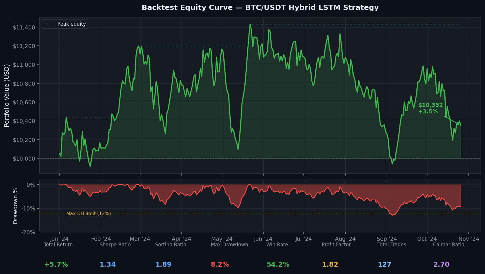
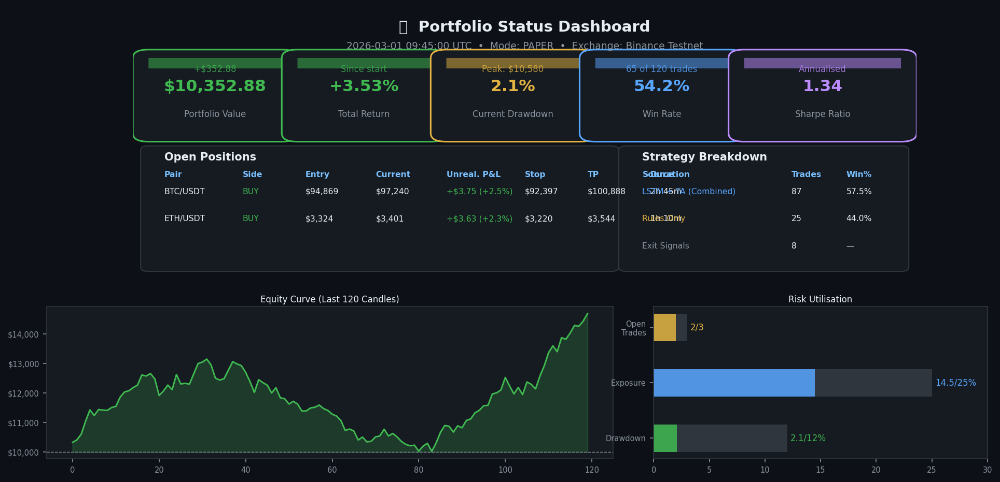
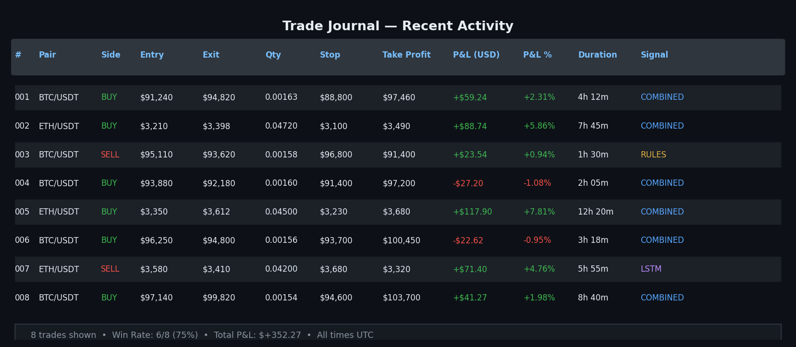
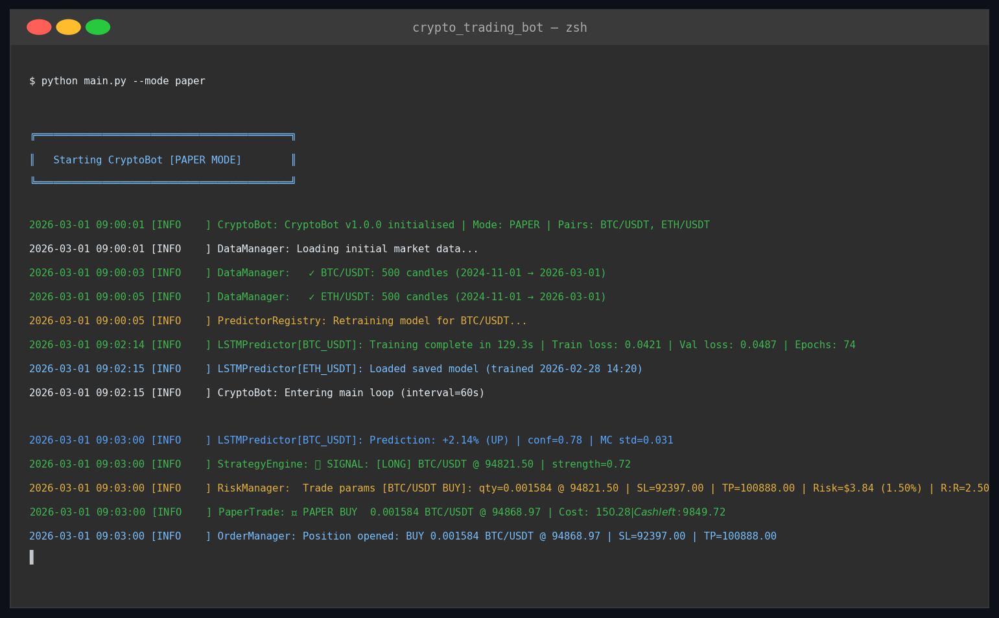
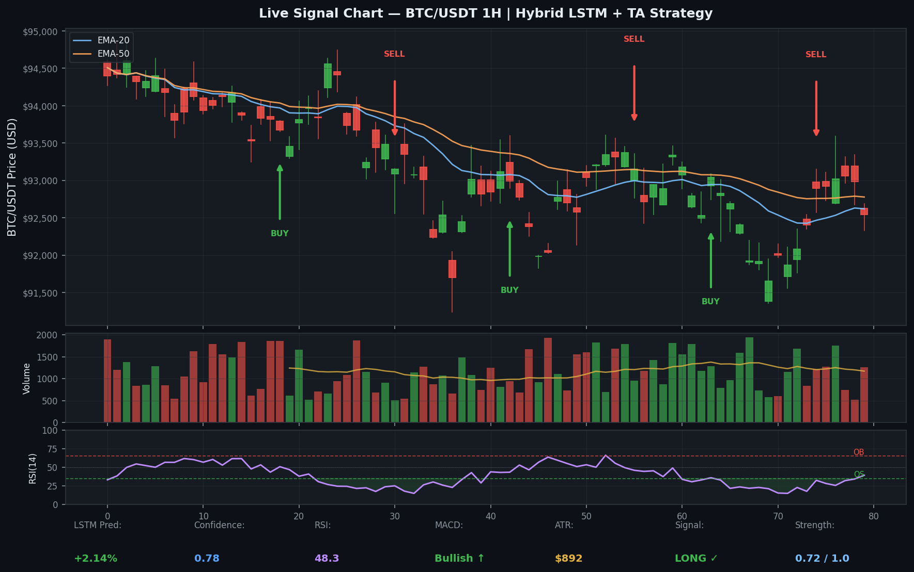
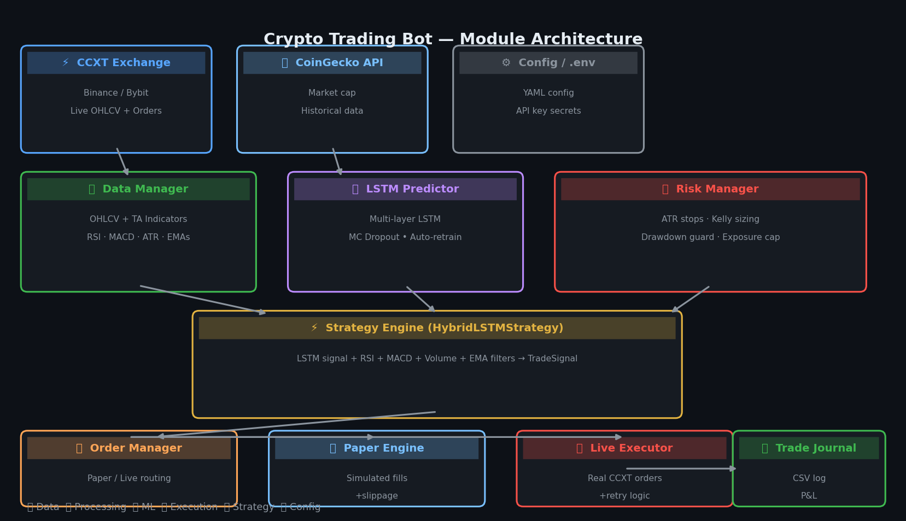

# Automated Cryptocurrency Trading Bot

## For a data analyst application

**Keep this off the first page of a data analyst resume.** It is a paper-trading research system. If you mention it, talk about the evaluation and the risk limits, and keep execution in paper mode in the story you tell.

A modular cryptocurrency-trading research system combining market-data retrieval, technical signals, LSTM price modelling, backtesting, paper execution, and portfolio risk controls.

## System Capabilities

- Exchange-market data ingestion through reusable adapters
- Feature preparation for technical and machine-learning signals
- LSTM model training and inference
- Configurable strategy and signal aggregation
- Position sizing, stop controls, and portfolio exposure limits
- Historical backtesting with performance metrics
- Paper-trading execution and structured logging
- YAML-based runtime configuration

## Visual Evidence

The screenshots are interface illustrations for the write-up. They are not the output of `python backtest.py`. Measured results are the metrics table that command prints, including buy-and-hold.

### Bot Startup

### Backtest & Drawdown

### Signal Analysis

### Architecture

### Trade Journal

## Architecture

~~~text
Exchange / Market Data
          ↓
Data Fetcher → Feature Pipeline → LSTM Predictor
          ↓                         ↓
          └────── Strategy Engine ──┘
                         ↓
                  Risk Management
                         ↓
               Paper Order Execution
                         ↓
                 Logs & Performance
~~~

## Quick Start

~~~bash
git clone https://github.com/ParBproject/Crypto-Trading-Bot.git
cd Crypto-Trading-Bot

python -m venv .venv
source .venv/bin/activate
pip install -r requirements.txt

python train_model.py
python backtest.py
python main.py
~~~

Review `config/config.yaml` before running. `trading.mode` defaults to `paper`. Live orders are refused unless `ALLOW_LIVE_TRADING=1`, and `main.py` still asks for a confirmation phrase. Real-money keys also require `exchange.sandbox: false`.

## Repository Structure

~~~text
Crypto-Trading-Bot/
├── main.py
├── train_model.py
├── backtest.py
├── config/config.yaml
├── src/
│   ├── bot.py
│   ├── data_fetcher.py
│   ├── predictor.py
│   ├── strategy.py
│   ├── risk_manager.py
│   ├── executor.py
│   └── logger.py
├── docs/screenshots/
└── requirements.txt
~~~

## Skills Demonstrated

Python, modular system design, time-series modelling, TensorFlow, exchange data integration, backtesting, configuration management, paper execution, logging, and financial risk controls.

## Backtest assumptions

`python backtest.py` walks one bar at a time:

- A signal is computed at the close and filled at the next bar's open. It does not trade that same bar's close.
- Stop-loss and take-profit are resting orders. They fill from the bar's high and low. If both are touched, the stop fills first. A gap through the level fills at the open.
- `backtest.commission_pct` and `backtest.slippage_pct` are percents (`0.1` means 0.1%). Each is charged on entry and on exit.
- The equity curve marks open positions to market, so drawdown includes unrealized losses. Sharpe and Sortino use the bar spacing in the data rather than assuming every series is hourly.
- `buy_hold_return_pct` is a fully invested long from the first bar the strategy could have traded through the last close, with the same fees and slippage. The strategy sizes from the risk budget, so the two returns are not the same bet size.

## Risk & Security Notice

This project is educational and is not financial advice. Automated trading can create rapid losses. Never commit API credentials, never enable withdrawals on a trading key, and do not use real capital without independent testing, monitoring, compliance review, and a verified emergency-stop procedure.
