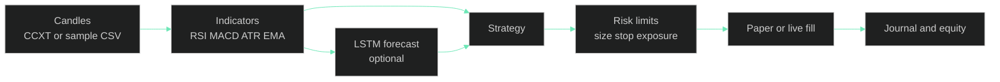
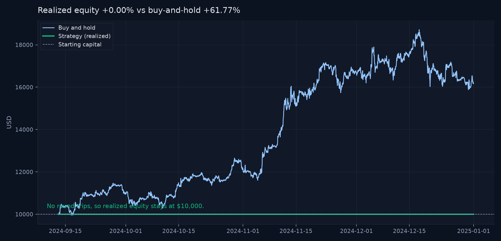
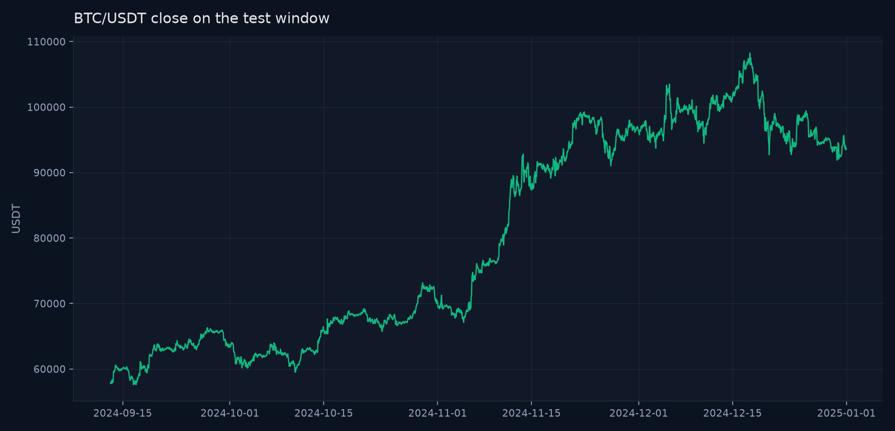
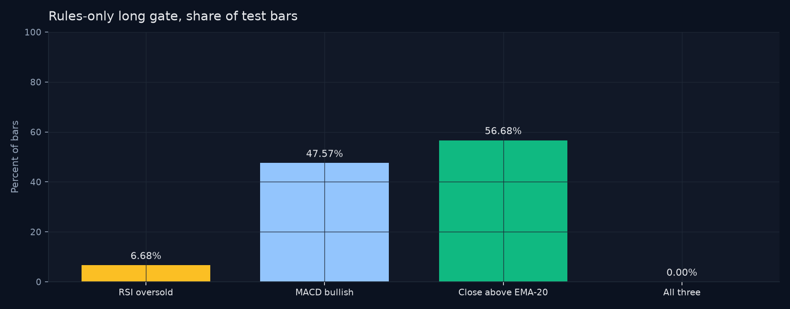

# Crypto Trading Bot

<p align="center">
  <a href="https://www.python.org/"></a>
  <a href="https://github.com/ParBproject/Crypto-Trading-Bot/actions/workflows/ci.yml"></a>
  <a href="LICENSE"></a>
  <a href="config/config.yaml"></a>
</p>

Paper-trades crypto pairs from hourly candles, with technical filters, an optional LSTM forecast, and hard limits on size, stops, exposure, and drawdown.

## Overview

The bot is a research loop for one decision: given the latest candles, open a paper long, open a paper short, or do nothing, and if it trades, how large the order should be.

On each pass it loads OHLCV for the pairs in `config/config.yaml`, then adds RSI, MACD, ATR, Bollinger Bands, and moving averages. An optional per-pair LSTM forecasts the next candle's percent change. `HybridLSTMStrategy` turns that forecast, or a technical fallback, into a signal. `RiskManager` sizes the order from ATR and rejects it when drawdown, the open-trade count, or single-asset exposure is past the cap in config. `OrderManager` fills in paper mode unless you explicitly switch to live and confirm the prompt.

The charts below come from one rules-only replay of committed Binance spot candles. Read them as the record of that run.

## Features

- CCXT candles for any exchange id in config, with paged history for the backtest dates, a Binance archive fallback, and a CoinGecko OHLC fallback
- Indicator pipeline that uses `pandas_ta` when it is installed and a pure-pandas implementation otherwise
- Optional stacked LSTM that outputs a percent-change forecast, with Monte Carlo dropout used as a confidence score
- Hybrid entries (forecast plus RSI, MACD, volume, and EMA gates) and a rules-only fallback when no forecast is available
- Fixed-fraction sizing, or fractional Kelly when a win rate is supplied, with ATR stops and a reward-to-risk target
- Drawdown halt, a cap on open trades, and a per-asset exposure cap
- Paper fills with slippage and commission; live orders go through CCXT only when `trading.mode` is `live`
- CSV trade journal, rotating logs, and optional Telegram or Discord alerts
- Walk-forward backtest that calls the same strategy and risk objects as the bot

## Architecture


```mermaid
%%{init: {'theme': 'dark', 'themeVariables': {'primaryColor':'#064e3b','primaryTextColor':'#ecfdf5','primaryBorderColor':'#10b981','lineColor':'#6ee7b7','secondaryColor':'#111827','tertiaryColor':'#0b1220','background':'#0b1220','fontFamily':'ui-sans-serif, system-ui, sans-serif'}}}%%
flowchart LR
    A[Candles<br/>CCXT or sample CSV] --> B[Indicators<br/>RSI MACD ATR EMA]
    B --> C[LSTM forecast<br/>optional]
    B --> D[Strategy]
    C --> D
    D --> E[Risk limits<br/>size stop exposure]
    E --> F[Paper or live fill]
    F --> G[Journal and equity]
```

## Sample backtest

`scripts/reproduce_backtest.py` loads the committed 2024 hourly file, builds indicators with `IndicatorCalculator`, and runs `BacktestEngine` with the LSTM off. The same file and the same code produce the same trades and the same charts. It runs offline from that CSV.

| | |
|---|---|
| Sample | Binance spot BTC/USDT, 1-hour, 1 Jan 2024 00:00 UTC through 31 Dec 2024 23:00 UTC |
| File | [`data/sample/btcusdt_1h_2024.csv`](data/sample/btcusdt_1h_2024.csv) — 8,784 bars, no gaps, from the public monthly archive on data.binance.vision |
| Bars the engine traded | Last 30% of the file (the built-in split): 13 Sep 2024 04:00 UTC through 31 Dec 2024 23:00 UTC, 2,636 bars |
| Starting capital | $10,000 |
| Rules for a long | RSI below 35, MACD above its signal, and close above EMA-20, all on the same bar |
| Trades | 0 |
| Ending realized equity | $10,000.00 (0.00%) |
| Buy and hold, same bars | $16,177.30 (+61.77%), close from 57,844 to 93,576 |
| Max drawdown of realized equity | 0.00% |
| Sharpe | 0.0 |
| Sortino | 0.0 |

The rule set stayed in cash. On the 2,636 test bars, RSI was oversold 6.68% of the time, MACD was bullish 47.57% of the time, and the close was above EMA-20 56.68% of the time. All three were true together on **0** bars, so the risk manager never sized an order.

The LSTM threshold is a high bar on this same window, and this run did not train a model. The median absolute hourly move was 0.242%, the 95th percentile was 1.122%, and 2.24% of hours moved 1.5% or more. Config asks for a predicted move of at least +1.5% before a long is even considered.

<p align="center"></p>

<p align="center"></p>

<p align="center"></p>

Regenerate the table and the charts from a checkout:

```bash
python scripts/reproduce_backtest.py
```

[`docs/results/metrics.json`](docs/results/metrics.json) is the raw record. [`docs/results/trades.csv`](docs/results/trades.csv) is the closed-trade log. For this run the log is header-only.

## Quickstart

These commands are enough to regenerate the sample backtest and run the tests from a fresh clone.

```bash
git clone https://github.com/ParBproject/Crypto-Trading-Bot.git
cd Crypto-Trading-Bot
python3 -m venv .venv
source .venv/bin/activate
pip install numpy pandas PyYAML python-dotenv scikit-learn tabulate matplotlib pytest
python scripts/reproduce_backtest.py
python -m pytest
```

On Windows, activate the environment with `.venv\Scripts\activate`.

### Run the paper loop

The full dependency list adds the exchange client, TensorFlow, and the optional alert packages:

```bash
pip install -r requirements.txt
cp .env.example .env
# config/config.yaml is already in the repo (paper mode, sandbox).
# If it is missing, main.py asks you to copy the template:
# cp config/config.yaml.example config/config.yaml
python main.py --mode paper
```

`main.py` repeats until you stop the process. Live orders start only after `--mode live` and the confirmation prompt. Keep the sandbox flag in `config/config.yaml` until the exchange path has been checked with testnet credentials.

`python backtest.py` loads the committed window, 1 Jan 2023 through 1 Jan 2024, instead of the 500-bar live lookback. It reads public historical candles for that range. When the exchange REST call fails, Binance symbols fall back to the monthly archive on data.binance.vision. `backtest.commission_pct` is a percent (`0.1` means 0.1% per fill), charged once on entry and once on exit. If TensorFlow is not installed, that command continues with the rules-only strategy.

## Tests

```bash
python -m pytest
```

[`.github/workflows/ci.yml`](.github/workflows/ci.yml) runs that suite on every push and pull request, on Python 3.11, after a Ruff syntax check and `compileall`. The tests cover paper closes, backtest entry and exit fees, the configured history window, CoinGecko OHLC columns, Sortino on a flat curve, and the example config.

## Project structure

```text
Crypto-Trading-Bot/
├── main.py                      # paper and live loop
├── backtest.py                  # walk-forward backtest
├── train_model.py               # standalone LSTM training
├── scripts/reproduce_backtest.py
├── config/config.yaml
├── config/config.yaml.example   # paper/sandbox template, no secrets
├── data/sample/                 # 2024 BTC/USDT hourly candles
├── docs/results/                # metrics, trades, charts
├── src/
│   ├── bot.py
│   ├── data_fetcher.py
│   ├── predictor.py
│   ├── strategy.py
│   ├── risk_manager.py
│   ├── executor.py
│   └── logger.py
├── tests/
├── .github/workflows/ci.yml
├── requirements.txt
└── LICENSE
```

## Limitations and next steps

- The rules-only long requires three conditions on the same bar: RSI below 35, MACD above its signal, and close above EMA-20. On this test window those three never occurred together (0 of 2,636 bars), so the backtest opened no trades while the test-window price rose 61.77%.
- The published run is one pair, hourly spot candles for 2024, rules only, and only the last 30% of the file. Entry and exit rules were left as they are.
- Equity in the backtest updates when a trade closes. Open positions are carried at entry, so the curve is realized equity.
- Sharpe and Sortino are both 0.0 on this run. Sortino stays 0 unless at least two equity returns are negative, which is this flat curve.
- Order routing still follows `exchange.sandbox`. The backtest history request uses public candles, with the Binance monthly archive as a fallback when the REST call fails.
- Next step worth doing before any performance claim: mark open positions to market, and score an LSTM forecast against buy-and-hold on this fixed file.

This is a research project. Paper mode is the path the tests and the sample run cover. Nothing here is a recommendation to trade.

## License

MIT. See [LICENSE](LICENSE).
